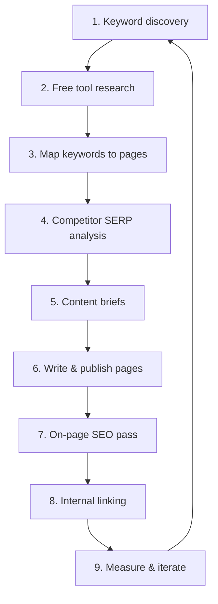

# Onsite content SEO — plan

**Site:** [hackswipe.app](https://hackswipe.app)
**Product:** Chrome extension that auto-swipes Tinder using your own filters (age, distance, minimum photos, bio keyword bans) — 3-day free trial, then a one-time Lifetime unlock.
**Scope:** On-page content and site structure only (not link building, paid ads, or off-site distribution).

**Related docs:** [`kws-list.md`](./kws-list.md) · [`tools.md`](./tools.md)

**Last updated:** 2026-07-17

---

## Goal

Rank for keywords that match what we actually do (Tinder auto-swipe, Chrome extension, honest no-Gold-needed positioning) and convert visitors into trial installs or Lifetime purchases.

---

## Process overview



---

## Phase 1 — Keyword discovery

**Objective:** Find keywords we can rank for — or should rank for — given our product, content, and honest scope.

### Steps

1. **Start from product truth** — List jobs-to-be-done: auto-swipe Tinder with filters, avoid paying for Gold/Boosts, save time swiping, choose who to actually match with.
2. **Brainstorm seed terms** — Head terms (`tinder auto swiper`), long-tail (`how to get tinder matches without paying`), compare intent (`swipemate alternative`), use-case intent (`tinder filters extension`).
3. **Expand with tools** — See Phase 2; pull volume, difficulty, and related queries.
4. **Filter ruthlessly** — Drop or deprioritize:
   - Other dating apps (Bumble, Hinge, OkCupid, etc.) — Tinder only in v1
   - Dev/API/scraping intent — we're a no-code DOM-based extension, not a Tinder API client
   - Terms implying we message or match on the user's behalf (we only swipe; the user picks matches)
5. **Score and prioritize** — Fit × intent × realistic difficulty. Maintain the shortlist in [`kws-list.md`](./kws-list.md).

### Output

- Updated priority table in `kws-list.md`
- Cluster labels (e.g. "auto-swipe how-to", "Tinder Gold alternative", "compare vs SwipeMate/Auto Swiper/Matched")

---

## Phase 2 — Free tool research

**Objective:** Do keyword and competitor research without paid subscriptions where possible.

### What to research

| Need | Free / freemium options to evaluate |
|------|-------------------------------------|
| Keyword ideas & volume | Google Keyword Planner (needs Ads account), Google Trends, AlsoAsked, Ubersuggest free tier, Keyword Surfer (Chrome) |
| SERP preview / who ranks | Manual Google search, Ahrefs/SEMrush free trials, Mangools free tier |
| Competitor pages | Google `site:competitor.com`, manual browse, Chrome Web Store listing pages |
| Questions / PAA | AlsoAsked, r/Tinder and r/dating_advice threads, People Also Ask |
| Rank tracking (later) | Google Search Console, Bing Webmaster Tools |

### Steps

1. **Inventory free tiers** — For each tool: limits (searches/day, exports), data quality, and whether results are worth saving.
2. **Document findings** — Add a "Free tools" section to [`tools.md`](./tools.md) with verdicts (use / skip / trial only).
3. **Build a repeatable workflow** — e.g. monthly: Trends check → AlsoAsked for top 5 guides → GSC queries we already rank for → update `kws-list.md`.

### Output

- Free-tool cheat sheet in `tools.md`

---

## Phase 3 — Map keywords to pages

**Objective:** Every target keyword gets a home — no orphan content, no keyword cannibalization.

### Page types we already use

| Type | Path pattern | Best for |
|------|--------------|----------|
| Homepage | `/` | Head terms, brand, primary CTA |
| Guides | `/guides/*` | How-to, use cases, educational intent |
| Compare | `/compare/*` | "X vs Y", alternative intent |
| FAQ | `/faq` | Short answers, long-tail questions |
| Pricing | `/pricing` | Trial vs Lifetime, commercial intent |

### Steps

1. **One primary keyword per URL** — Secondary terms support in H2s and body; don't create two guides for the same intent.
2. **Fill the content matrix** — In `kws-list.md`: Keyword → URL (existing or **new**) → status (live / draft / backlog).
3. **Resolve gaps from competitor research** — e.g. a new "is auto-swiping against Tinder's rules" FAQ if that question keeps surfacing.

### Output

- Keyword → URL map with publish priority

---

## Phase 4 — Competitor & SERP analysis

**Objective:** See who ranks today, what page types win, and what we need to beat them.

### Steps

1. **Pick competitors** — See list in [`tools.md`](./tools.md) (SwipeMate, Matched Auto Swiper, Free Auto Swiper for Tinder, auto-swiper.ch, autoswipe.net).
2. **For each priority keyword, search Google** — Note top 10: domain, URL, page type (Chrome Web Store listing, tool landing page, forum thread, video).
3. **Analyze patterns** — Title format, screenshots, FAQ blocks, pricing transparency, trust signals (not-affiliated-with-Tinder disclaimers).
4. **Identify gaps we can own** — Transparent one-time pricing, honest "not affiliated with Tinder" positioning, filter depth (bio keyword bans, minimum photos) that competitors don't advertise clearly.
5. **Record in `kws-list.md`** — Compare page keyword mapping (already started for our 3 live compare pages).

### Output

- Per-keyword SERP notes (who ranks, page type, rough content depth)
- Shortlist of competitor URLs/listings to outrank → feeds Phase 5

---

## Phase 5 — Content briefs (before writing)

**Objective:** Define what "better" means for each page before drafting.

### Brief template (copy per page)

```markdown
## [Page title / target URL]

**Primary keyword:**
**Secondary keywords:**
**Search intent:** informational | commercial | compare
**Competitor URLs to beat:**
1.
2.

**Must cover:**
- [ ] User problem in first 100 words (time/money spent swiping manually)
- [ ] Step-by-step with extension screenshots where relevant
- [ ] "Not affiliated with Tinder or Match Group" disclaimer where relevant
- [ ] Trial vs Lifetime pricing stated clearly
- [ ] FAQ block (3–5 questions)
- [ ] CTA (install / pricing)

**Differentiation vs competitors:**
**Internal links to add:**
**Suggested title tag (≤60 chars):**
**Suggested meta description (≤155 chars):**
```

### Steps

1. Write a brief for each priority keyword from `kws-list.md`.
2. Align with E-E-A-T — Real product screenshots, accurate limits (3-day trial vs Lifetime), no fake claims about match rates or guaranteed results.

### Output

- Brief per new or major refresh page

---

## Phase 6 — Write & publish content

**Objective:** Ship pages that match intent and convert.

### Steps

1. **Draft** — Follow brief; use consistent voice with existing guides (`how-to-auto-swipe-on-tinder`, `tinder-filters-that-actually-work`, `stop-paying-for-tinder-gold`, `tinder-auto-swiper-chrome-extension`).
2. **Add assets** — Screenshots or short screen recordings of the side panel and filter setup.
3. **Publish** — New guide or compare route in `landing/src/config/guides.ts` / `compare-pages.ts`; ensure sitemap and nav/index links include the page.
4. **First-pass QA** — Read on mobile; links work; CTA visible; no overclaiming on match outcomes.

### Output

- Live URL
- Status update in keyword → URL map

---

## Phase 7 — On-page SEO pass

**Objective:** Make each page technically and semantically clear to search engines.

### Checklist (every page)

- [ ] **Title tag** — Primary keyword near front; brand at end if room
- [ ] **Meta description** — Benefit + CTA; not keyword stuffing
- [ ] **H1** — One per page; matches intent
- [ ] **H2/H3** — Related terms and question phrasing
- [ ] **URL slug** — Short, keyword-rich (`/guides/stop-paying-for-tinder-gold`)
- [ ] **First paragraph** — Answers the query early
- [ ] **Images** — Descriptive alt text
- [ ] **Schema** — `Article` or `FAQPage` where appropriate
- [ ] **Canonical** — Correct if duplicates possible
- [ ] **Open Graph** — Title, description, image for sharing

### Site-wide (ongoing)

- [ ] **Google Search Console** — Property verified; sitemap submitted
- [ ] **Core pages indexed** — Homepage, pricing, top guides
- [ ] **Page speed** — Reasonable LCP on guide pages
- [ ] **Mobile-friendly** — Readable without horizontal scroll

### Output

- Completed on-page checklist per page

---

## Phase 8 — Internal linking

**Objective:** Pass relevance and help users (and crawlers) discover related content.

### Rules of thumb

1. **Guides ↔ compare** — Guides link to relevant compare pages and vice versa.
2. **Contextual links** — From homepage, FAQ, and related guides to new pages with descriptive anchor text.
3. **Footer / nav** — Only for highest-value evergreen pages; don't bloat global nav.

### Output

- Internal link map or a simple "links added" note per publish

---

## Phase 9 — Measure & iterate

**Objective:** Close the loop — double down on what works, refresh what stalls.

### Steps

1. **GSC** — Impressions, clicks, average position for target keywords (4–8 weeks after publish).
2. **Track rankings** — Manual spot-checks or free tier tracker for top 20 keywords.
3. **Refresh underperformers** — Update title, add FAQ, more screenshots, or merge thin pages.
4. **Quarterly content audit** — Accuracy (Tinder UI changes, pricing changes), broken links, new competitor names.

### Output

- Simple rank/traffic log (date, keyword, URL, position, notes)
- Refresh backlog in `kws-list.md`

---

## Open questions / decisions

- [ ] Which free rank tracker is good enough long-term vs occasional SEMrush trial?
- [ ] Do we add a `/blog` or keep everything under `/guides` and `/compare`?
- [ ] Content refresh cadence — quarterly vs when GSC shows decay, vs whenever Tinder changes its UI?

---

## Changelog

| Date | Change |
|------|--------|
| 2026-07-17 | Rewritten for HackSwipe (Tinder auto-swiper); superseded the original Social Scraper+ plan |
